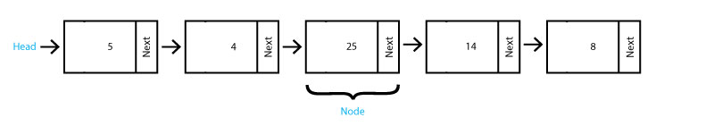
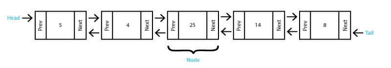
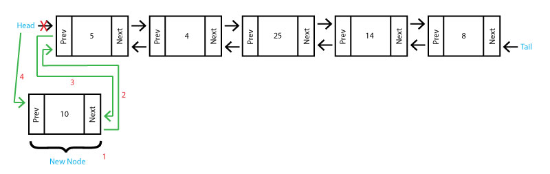
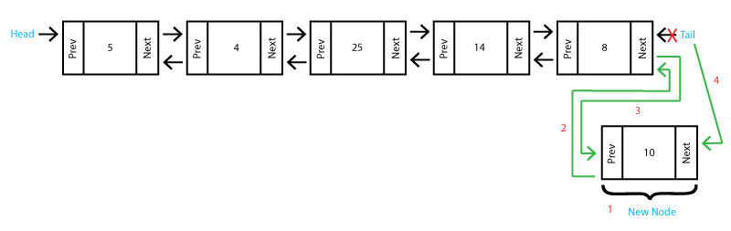
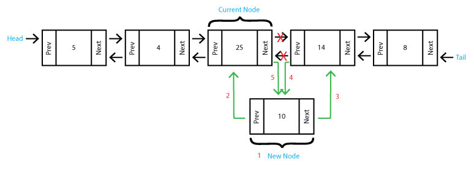
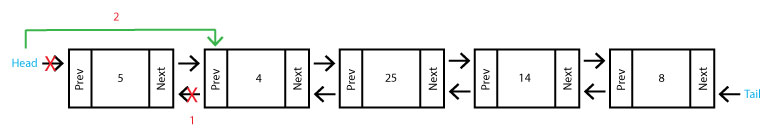
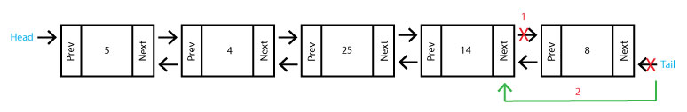

# Linked List

## Overview
* [What is a Linked List?](#what-is-a-linked-list)
* [Using a Linked List](#using-a-linked-list)
    * Inserting data into a linked list
    * Removing data from a linked list
    * Accessing data from a linked list
* [Operations & Performance](#operations-and-performance)
    * Insert
    * Remove
    * Size
    * Empty
* [Comparing Linked List to Dynamic Array](#comparing-linked-list-to-dynamic-array)
* [Code Example](#code-example)
* [Try it Yourself](#try-it-yourself)

## What is a Linked List?
Unlike a dynamic array where each item in the list is contiguous in memory, the items in a linked list are stored randomly within memory. In order to know where each item (or **Node**) is, each **Node** contains the value, and also the link to the **Next Node**. In a **Doubly-linked List**, the **Node** will also contain the link to the **Previous Node**. The links are **Pointers** to the memory locations where each **Node** is stored.

We can see in the **Linked List** below that the first **Node** is called the **Head**. From the **Head** you can traverse the entire linked list by following the pointers.



In this **Doubly-Linked List** below we can see that the last **Node** is called the **Tail**. We can also see that there are **Pointers** going both directions. This is known as bi-directional linking. In a **Doubly-Linked List** Each **Node** contains the value as well as **Pointers** which link to the **Previous Node** and **Next Node**.



## Using a Linked List

Let's talk about **Inserting** into a linked list. Unlike inserting into a dynamic array where we had to move every item over to maintain contiguous memory, adding to a linked list only affects its nearest neighbors. We will talk about inserting at the **Head**, at the **Tail** and in the **Middle**. Keep in mind that if the linked list is empty, all you have to do is set the head and the tail to the new node.

Inserting at the **Head** can be done in four steps:
    
1. Create a new node called **new_node**
1. Set the Next of the new node to the current Head (**new_node.next = self.head**)
1. Set the Prev of the current head to the new node (**self.head.prev = new_node**)
1. Set the head equal to the new node (**self.head = new_node**)



Inserting at the **Tail** is much the same as inserting at the head:

1. Create a new node called **new_node**
1. Set the Prev of the new node to the current tail (**self.tail.prev = self.tail**)
1. Set the Next of the current tail to the new node (**self.tail.next = new_node**)
1. Set the tail equal to the new node (**self.tail = new_node**)



Inserting into the **Middle** of a linked list is a little more complicated. Let's insert after our current node. This can be done in five steps:

1. Create a new node called **new_node**
1. Set the prev of the new node to the current node (**new_node.prev = current**)
1. Set the next of the new node to the next node after our current node (**new_node.next = current.next**)
1. Set the prev of the next node after our current node to the new node (**current.next.prev = new_node**)
1. Set the next of the current node to the new node (**current.next = new_node**)



Now let's talk about **Removing** from a linked list. Removing from the head node or the tail node are similar and involves updating the neighboring nodes. If there is only one node in the list, set the head and the tail to **None** to create an empty linked list.

Removing from the head takes two steps:

1. Set the prev of the second node to nothing (**self.head.next.prev = None**)
1. Set the head to be the second node (**self.head = self.head.next**)



Removing from the tail goes as shown:

1. Set the next of the second to last node to nothing (**self.tail.prev.next = None**)
1. Set the tail to be the second to last node (**self.tail = self.tail.prev**)



Removing from the middle is much easier than inserting to the middle and can be done in two steps:

1. Set the prev of the node after current to the node before current (**current.next.prev = current.prev**)
1. Set the next of the node before current to the node after current (**current.prev.next = current.next**)


To access data from a linked list, we have to loop through the linked list. We can start from either the head and loop forward, or start at the tail and loop backwards. We use **next** to go forward, and **prev** to go backwards until we reach our goal. To do a basic traversal we can do the following:

```python
def traverse_forward(self):
    # start at the head
    current = self.head

    # loop until we reach the end
    while current is not None:
        # print current node
        print(current.data)

        # Go to the next node
        current = current.next
```
## Operations and Performance

While you can create your own linked list, python has one built in called a **Deque**. To create an empty linked list, Use the following import statement: ```import deque```, and the follwing code: ```linked_list = deque()```. Below are some common functions of the **Deque**:

## Comparing Linked List to Dynamic Array

## Code Example

## Try it Yourself

Ready of the [next challenge](../Tree/Tree.md)? or [Return to overview](../README.md)
