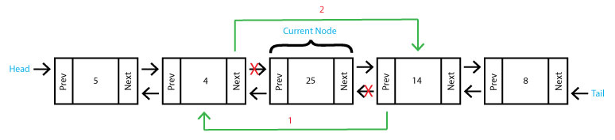

# Linked List

## Overview
* [What is a Linked List?](#what-is-a-linked-list)
* [Using a Linked List](#using-a-linked-list)
    * Inserting data into a linked list
    * Removing data from a linked list
    * Accessing data from a linked list
* [Operations & Performance](#operations-and-performance)
    * Insert
    * Remove
    * Empty
* [Comparing Linked List to Dynamic Array](#comparing-linked-list-to-dynamic-array)
* [Code Example](#code-example)
* [Try it Yourself](#try-it-yourself)

## What is a Linked List?
Unlike a dynamic array where each item in the list is contiguous in memory, the items in a linked list are stored randomly within memory. In order to know where each item (or **Node**) is, each **Node** contains the value, and also the link to the **Next Node**. In a **Doubly-Linked List**, the **Node** will also contain the link to the **Previous Node**. The links are **Pointers** to the memory locations where each **Node** is stored.

We can see in the **Linked List** below that the first **Node** is called the **Head**. From the **Head** you can traverse the entire linked list by following the pointers.


In this **Doubly-Linked List** below we can see that the last **Node** is called the **Tail**. We can also see that there are **Pointers** going both directions. This is known as bi-directional linking. In a **Doubly-Linked List** Each **Node** contains the value as well as **Pointers** which link to the **Previous Node** and **Next Node**.


## Using a Linked List

Let's talk about **Inserting** into a linked list. Unlike inserting into a dynamic array where we had to move every item over to maintain contiguous memory, adding to a linked list only affects its nearest neighbors. We will talk about inserting at the **Head**, at the **Tail** and in the **Middle**. Keep in mind that if the linked list is empty, all you have to do is set the head and the tail to the new node.

Inserting at the **Head** can be done in four steps:
    
1. Create a new node called **new_node**
1. Set the Next of the new node to the current Head (**new_node.next = self.head**)
1. Set the Prev of the current head to the new node (**self.head.prev = new_node**)
1. Set the head equal to the new node (**self.head = new_node**)


Inserting at the **Tail** is much the same as inserting at the head:

1. Create a new node called **new_node**
1. Set the Prev of the new node to the current tail (**self.tail.prev = self.tail**)
1. Set the Next of the current tail to the new node (**self.tail.next = new_node**)
1. Set the tail equal to the new node (**self.tail = new_node**)


Inserting into the **Middle** of a linked list is a little more complicated. Let's insert after our current node. This can be done in five steps:

1. Create a new node called **new_node**
1. Set the prev of the new node to the current node (**new_node.prev = current**)
1. Set the next of the new node to the next node after our current node (**new_node.next = current.next**)
1. Set the prev of the next node after our current node to the new node (**current.next.prev = new_node**)
1. Set the next of the current node to the new node (**current.next = new_node**)


Now let's talk about **Removing** from a linked list. Removing from the head node or the tail node are similar and involves updating the neighboring nodes. If there is only one node in the list, set the head and the tail to **None** to create an empty linked list.

Removing from the head takes two steps:

1. Set the prev of the second node to nothing (**self.head.next.prev = None**)
1. Set the head to be the second node (**self.head = self.head.next**)


Removing from the tail goes as shown:

1. Set the next of the second to last node to nothing (**self.tail.prev.next = None**)
1. Set the tail to be the second to last node (**self.tail = self.tail.prev**)


Removing from the middle is much easier than inserting to the middle and can be done in two steps:

1. Set the prev of the node after current to the node before current (**current.next.prev = current.prev**)
1. Set the next of the node before current to the node after current (**current.prev.next = current.next**)



To access data from a linked list, we have to loop through the linked list. We can start from either the head and loop forward, or start at the tail and loop backwards. We use **next** to go forward, and **prev** to go backwards until we reach our goal. To do a basic traversal we can do the following:

```python
def traverse_forward(self):
    # start at the head
    current = self.head

    # loop until we reach the end
    while current is not None:
        # print current node
        print(current.data)

        # Go to the next node
        current = current.next
```
## Operations and Performance

While you can create your own linked list, python has one built in called a **Deque**. To create an empty linked list, use the following import statement: ```import deque```, and the following code: ```linked_list = deque()```. Below are some common functions of the **Deque**:

|Linked List Operations|Description|Python Code|Performance|
|-|-|-|-|
|insert_head(value)|Adds value before the head|**deque.appendleft(value)**|O(1) Just need to adjust the pointers near the head|
|insert_tail(value)|Adds value after the tail|**deque.append(value)**|O(1) Just need to adjust the pointers near the tail|
|insert(i,value)|Adds value after node i|**deque.insert(i,value)**|O(n) Requires a loop to find the node to insert after node|
|remove_head()|Removes the head|**deque.popleft()**|O(1) Just need to adjust the pointers near the head|
|remove_tail()|Removes the tail|**deque.pop()**|O(1) Just need to adjust the pointers near the tail|
|remove(i)|Removes the node at i|**del deque(i)**|O(n) Requires a loop to find the node to remove|
|empty()|Returns true if the length of the linked list is 0|**if len(deque) == 0**| O(1) The comparison is all that is needed|

## Comparing Linked List to Dynamic Array

The dynamic array and the linked list appear to work the same to the user, but because their memory is managed differently, the performance is different between them. The table below compares the two:
|Operation|Dynamic Array|Linked List|
|-|-|-|
Insert Front|O(n)|O(1)|
Insert Middle|O(n)|O(n)|
Insert End|O(1)|O(1)|
Remove Front|O(n)|O(1)|
Remove Middle|O(n)|O(n)|
Remove End|O(1)|O(1)|

We can see that the dynamic array has good performance only at the end, whereas the linked list had good performance at both the beginning and the end. Thinking back to our stack in the previous tutorial, our stack could use either a dynamic array or a linked list with the same performance.

## Code Example

Now let's implement the linked list.

First we create a class for our linked list, and an inner class for our nodes.

```python
class LinkedList:
    class Node:
```
Now we need to define the data and the links to the previous and next nodes. Initially these will be set to None. This is done in the Node class.

```python
def __init__(self, data):
    self.data = data
    self.next = None
    self.prev = None
```
Now we define an empty linked list by setting the head and tail to None. This is done in the LinkedList class.

```python
def __init__(self):
    self.head = None
    self.tail = None
```

Now let's define insert_head. We will first want to check if the linked list is empty. This can be done by checking if the head is None. If it is, then set both our head and our tail to the new node. If it is not empty then we can add our new node to the front of the linked list.

```python
def insert_head(self, value):
    new_node = LinkedList.Node(value)

    if self.head is None:
        self.head = new_node
        self.tail = new_node

    else:
        new_node.next = self.head
        self.head.prev = new_node
        self.head = new_node
```
Now let's define remove_head. If the linked list only has one item in it we will want to set the head and the tail to None. This will make the linked list empty. Otherwise we will just remove the head from the linked list.

```python
def remove_head(self):
    if self.head == self.tail:
        self.head = None
        self.tail = None
    
    elif self.head is not None:
        self.head.next.prev = None
        self.head = self.head.next
```

Lastly, let's implement an iterator that will work through the list starting at the head. Curr will keep track of which node we are currently at.
```python
def __iter__(self):
    curr = self.head
    while curr is not None:
        yield curr.data
        curr = curr.next
```
Congratulations! You now know how a linked list works. To see the code example with included tests, click [here](linkedList.py).

## Try it Yourself

Now it's your turn. Try to implement insert_tail, remove_tail, insert_middle, and remove_middle and their respective tests.

To view the solution, click [here](linkedList2.py).

Ready for the [next challenge](../Tree/Tree.md)? or [Return to overview](../README.md)
