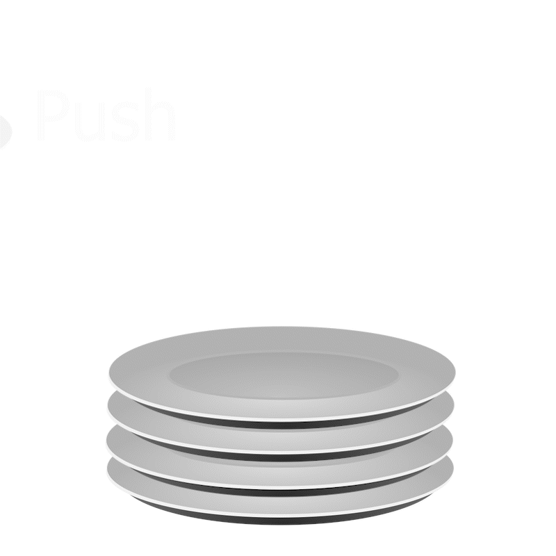
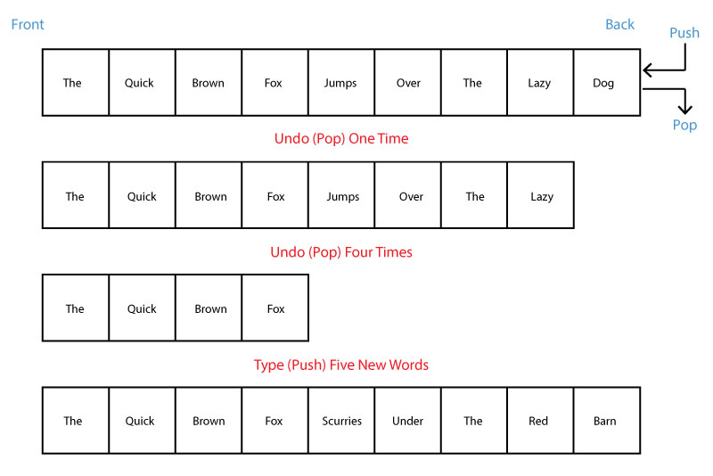

# Stack

## Overview
* [What is a stack?](#what-is-a-stack)
* [Using a stack](#using-a-stack)
    * Stack of plates
    * Undo Function
* [Operations & Performance](#operations)
    * Push
    * Pop
    * Peek
    * Empty
* [Code Example](#code-example)
* [Try it Yourself!](#try-it-yourself)


## What is a Stack?
A stack is a data structure that follows a particular order in which the operations are to be performed. The order is primarily referred to as *"Last in, First Out"* or *"LIFO"*. The stack can be used to complete many different tasks, and in this tutorial will be implemented with a python list.

## Using a Stack
### **A Stack of Plates**
To explain how a stack works, we will be using the example of a stack of plates at a buffet line. When you want to add a plate to the stack, you are only able to add to the top of the stack. If you want to take away a plate, you can only remove from the top.



A stack in Python works much the same way. Adding to the back of the stack is called a **Push**. Removing from the back of the stack is called a **Pop**. Normally you do not **push** or **pop** from the middle of the stack as that is not as efficient as working from the back. We will talk more about performance later.

### **Undo Function**
Another example of how a stack can be used is in an undo function seen in most word processing programs. The words you type are **pushed** onto the stack. This creates a history of what has been typed. When you press undo the words are **popped** off of the stack. Let's look at an example.



On the first stack shown, we can see the phrase *"The quick brown fox jumps over the lazy dog"*. Each word was **Pushed** onto the stack one by one until the entire phrase was stored. 

On the second stack, we can see that when the undo button is pressed, it will **Pop** from the back of the stack. We can see on the second stack that the word *"Dog"* has been removed. If we undo four more times, four more items will be **Popped** off of the stack as shown in the third stack.

Now we can add five more words to the stack. If we type *"scurries under the red barn"*, we can see that each word was **Pushed** onto the stack replacing the original phrase.

## Operations & Performance
Let's review some of the operations of a stack.

| Stack Operations | Description | Python Code | Performance |
|-|-|-|-|
|push(value)|Adds "value" to the back of the stack.|stack.append(value)|O(1) Performance of adding to the end of a dynamic array|
|pop()|Removes and returns the item from the back of the stack.| value = stack.pop()|O(1) performance of removing from the end of dynamic array|
|peek()|Returns the top item of the stack.|stack[len(stack)-1]|O(1) performance of returning the last item of the dynamic array|
|empty()|Boolean expression returns true if length of stack is zero.| if len(stack) == 0:|O(1) performance of checking the size of the dynamic array.

## Code Example
Now let's implement a stack.

We must first implement the stack. We can do that with the following code:

```python
def createStack():
    stack = []
    return stack
```

Now we can implement each of the operations we mentioned above. We will start with push().

```python
def push(stack, item):
    stack.append(item) # When we push onto the stack, we use .append to add to the back.
```

Before we implement pop() or peek(), we will want to check if the stack is empty. So let's implement empty().
```python
def empty(stack):
    return len(stack) == 0 # This will return true if the length of the stack is 0
```

Now let's implement pop().

```python
def pop(stack):
    if (empty(stack)): # Check to see if the stack is empty
        print("Stack is empty")
    else:
        stack.pop() # Pop from the back of the list
```

Finally let's implement peek().
```python
def peek(stack):
    if (empty(stack)): # Check to see if the stack is empty
        print("stack is empty")
    else:
        print(stack[len(stack) - 1]) # Print the last item in the list

```

Congratulations! You have implemented a stack. You can view the full code implementation [here](stack1.py).

## Try it Yourself!
Now that you know how a stack works, try to use a stack to reverse the following strings of text:

racecar

stressed

a nut for a jar of tuna

To view the solution click [here](stack2.py).

Ready for the [next challenge](../Linked_list/Linked_list.md)? or [Return to overview](../README.md)
