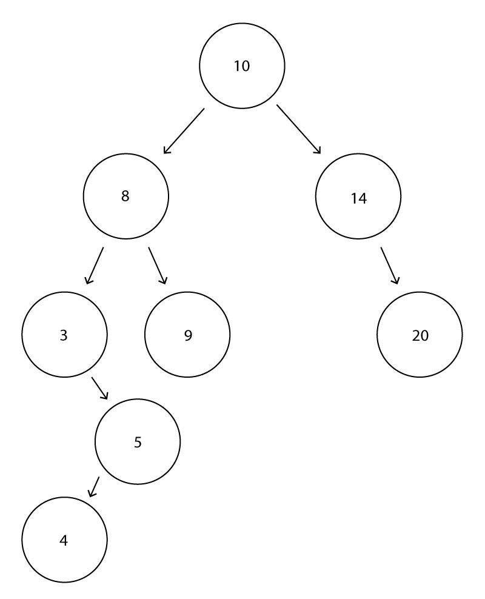

# Tree
* [What is a Tree?](#what-is-a-tree)
* [Using a Tree](#using-a-tree)
    * Binary Tree
    * Binary Search Tree
    * Balanced Binary Search Tree
* [Operations & Performance](#operations-and-performance)
    * Insert
    * Remove
    * Contains
    * Height
    * Traverse_forward
    * Traverse_reverse
    * Empty
* [Code Example](#code-example)
    * Inserting
    * Traversal
* [Try it Yourself](#try-it-yourself)

## What is a Tree?

A **Tree** is a lot like the linked list we learned about in the previous tutorial. However, one difference in a tree is that each node can link to multiple other nodes. In this tutorial we will learn about three different trees: **Binary Tree**, **Binary Search Tree**, and **Balanced Binary Search Tree**.

## Using a Tree

### **Binary Tree**

A **Binary Tree** is made up of multiple nodes. The first node, known as the **Root**, links to no more than two other nodes. Any node that has another node linked to it is called a **Parent** node. The nodes linked to the parent nodes are called **Children** nodes. Any node that does not link to any other node is called a **Leaf**  Any branch of nodes that comes from a parent node is known as a **Subtree**.


### **Binary Search Tree**

A **Binary Search Tree** is very similar to the binary tree mentioned above, however, data placed in the tree follows some simple rules. When placing data into the tree, the data is compared to the data inside the parent node. If the value of the added data is less then the value of the parent, it is placed on the left side. If the data is greater, it is placed on the right side. Any data that has a duplicate value can be placed on either side. By using a Binary Search Tree, the data added to the tree will automatically be stored in sorted order.


From this tree above, we can determine where new data will be placed. We start at the root node and compare our new value with it. Comparison continues until we find an empty place for the new node.

Let's look at the example below. We have a tree that is already populated with data. Let's add a node with the value of 12.

* First, start at the root of the tree and compare the values. Since 12 is greater than 10, our new node will go to the right.
* Now compare again. 12 is less than 14 so the node will go to the left.
* There is an empty spot there, so our new node will be inserted to the left of 14.


This process of storing data is very efficient. If we were to store sorted data into either a dynamic array, or a linked list, the performance would be O(n). By using a Binary Search Tree, we only have to work with one half of the data at a time. This results in a performance of O(log n).

However, to maintain this performance, our tree needs to remain balanced. As seen below; an unbalanced tree which contains the same data as before, looks a lot like a linked list. This results in a performance of O(n).


### **Balanced Binary Search Tree**

A **Balanced Binary Search Tree** is a tree which has a height difference between any two sub trees that is no more that 2 nodes. The hight of a sub tree can be found by counting the number of nodes between the root and the leaves. There are many different ways to determine if a tree is balanced, but one of the most common algorithims is known as the Adelson-Velskii and Landis Tree, or **AVL TREE**.

Below is an example of an AVL Tree. Starting at the root and going down to the leaf with a value of 5 results in a height of four. Starting from the root and going down to the leaf with a value of 9 results in a height of three. The difference in height between these two branches is only one, so the tree is balanced.


If we add the number 4 to the tree, this will add the new node to the left of node with the value of 5. Now the height of that branch is five, which makes the tree unbalanced.



To balance the tree, the AVL algorithm will perform a rotation. For our tree example, the node with 4 will be rotated, and the nodes with 3 and 5 will become the children of 4. This will return our tree back to a balanced state and our performance will remain O(log n).


## Operations and Performance

Here are some operations of a binary search tree:

|BST Operations|Description|Performance|
|-|-|-|
|insert(value)|Insert a value into the tree|O(log n) - Recursively search the tree to find the next available location|
|remove(value)|Remove a value from the tree|O(log n) - Recusivley search thre tree to find the value, then remove it. May require some cleanup of the neighboring nodes|
|contains(value)|Determine if a value already exists in the tree|O(log n) - Recursively search the tree to find the value|
|traverse_forward|Visit all values from smallest to largest|O(log n) - Recursively traverse the left subtree, then the right.|
|traverse_reverse|Visit all values from largest to smallest|O(log n) - Recursively traverse the right subtree, then the left.|
|height(node)|Determine the height of the node|O(log n) - Recursively find the maximum height of the left and right subtrees (plus one to account for the root).
|empty()|Returns true if the root node is empty|O(1) - The comparison of the root node.|

## Code Example

BST operations use recursion, which makes them complicated. We will talk about two different operations: inserting and traversing.

### **Inserting into a BST Using Recursion**

Before we step though the code, there are a couple of things we need to keep in mind. When using recursion we need to make sure an infinite loop is not created. To ensure this, a base case is needed to stop our loop. For our BST our base case will look to see if there is an empty subtree and will insert our node at that location. The other thing we need to figure out is whether to insert on the right subtree or the left subtree.

First, let's set up our BST class and node subclass as well as initialize them.

```python
class BST:
    class Node:
        # initialize our node. Currently the links are unknown, so they are set to None.
        def __init__(self, data):
            self.data = data
            self.left = None
            self.right = None
    def __init__(self):
        # initialize an empty BST
        self.root = None
```

Now let's create our insert functions. The insert() function will call our recursive _insert() function which will recursively move through our tree until it finds an empty node to place our data.

```python
def insert(self, data):
    # If our BST is empty make our new node the root
    if self.root is None: 
        self.root = BST.Node(data)
    # if not empty call our recursive function
    else:
        self._insert(data, self.root)

def _insert(self, data, node):
    # If data is less than our node...
    if data < node.data:
        # If left node is empty insert data
        if node.left is None:
            node.left = BST.Node(data)
        # Else, call _insert() again and start on the left node
        else:
            self._insert(data, node.left)
    # If data is greater than our node...
    else:
        # If right node is empty insert data
        if node.right is None:
            node.right = BST.Node(data)
        # Else, call _insert() again and start on the right node
        else:
            self._insert(data, node.right)

```
### **Traversing Through a BST Using Recursion**

We use a traversal when we want to display the data in the tree. A forward traversal will list all the nodes from smallest to largest. Simillarly, you can also use a reverse traversal to list the nodes from largest to smallest. 

A forward traversal will start on the left subtree of the node, then use the current node, then traverse the right subtree of the node. If the node is empty, then we do not recursively traverce.

```python
def _traverse_forward(self, node):
    if node is not None:
        # If the node is not empty traverse the tree
        yield from self._traverse_forward(node.left)
        yield node.data
        yield from self._traverse_forward(node.right)
```

## Try it Yourself
Now that you know how to use a Binary Search Tree, try making one yourself. Create a reverse traversal to list the numbers entered from greatest to least.

To view the solution, click [here](bst.py).

Congratulations! You have completed the Data Structures Tutorial. [Return to overview](../README.md)
